# 🚗 **Trung tâm điều khiển xe IoT**

Một hệ thống web điều khiển và giám sát xe IoT từ xa. Hỗ trợ quay video từ thiết bị, lưu trữ và phân quyền truy cập theo vai trò người dùng.


## 📝 **Giới thiệu**
Hệ thống quản lý và điều khiển xe IoT từ xa qua web với các tính năng chính:
- Quản lý người dùng theo vai trò (Admin, Vận hành, Người xem, Khách).
- Điều khiển xe từ xa thông qua giao diện trình duyệt.
- Ghi nhận video từ thiết bị IoT (ESP32-CAM).
- Lưu trữ, phân quyền và xem lại video.

## 📌 **Tính năng chính**

### 👥 Phân quyền người dùng
- **Admin**
  - CRUD người dùng, xe IoT, linh kiện.
  - Điều khiển xe từ xa.
  - Xem và xoá hình ảnh, video từ thiết bị IoT thu được.
- **Người vận hành**
  - Điều khiển xe.
  - Xem và xoá hình ảnh, video từ thiết bị IoT thu được.
- **Người xem**
  - Xem video livestream từ thiết bị IoT.
  - Xem và xoá hình ảnh, video từ thiết bị IoT thu được.
- **Khách**
  - Xem hình ảnh, video từ thiết bị IoT thu được.

### 🎮 Điều khiển xe IoT từ xa
- Giao diện điều khiển xe trực quan.
- Gửi tín hiệu điều khiển tới xe qua WebSocket.

### 🎥 Ghi hình từ thiết bị IoT
- Thiết bị sử dụng **ESP32-CAM** để quay video.
- Video được ghi lại bằng **FFmpeg.AutoGen**.
- Gửi video về server qua **WebSocket** theo định kỳ.

---

## ⚙️ **Công nghệ sử dụng**

| Thành phần               | Công nghệ                            |
|--------------------------|--------------------------------------|
| Frontend + Backend       | ASP.NET MVC                          |
| Authentication           | Cookie Auth                          |
| Giao tiếp IoT            | WebSocket                            |
| Video Ghi hình           | FFmpeg.AutoGen                       |
| CSDL                     | SQL Server                           |
| Thiết bị                 | ESP32, ESP32-CAM                     |

---

## 🚀 **Hướng dẫn cài đặt**
##### **1. Clone dự án:**
```bash
git clone https://github.com/QuanHa203/LuanVanTotNghiep.git
```

##### **2. Tạo CSDL:**
- Tải file [CarServerDb.sql](./Database/CarServerDb.sql).
- Mở SQL Server Management Studio.
- Tạo database trống với tên **CarServerDb**.
- Chạy script `CarServerDb.sql`.

##### **3. Mở bằng Visual Studio 2022.**

##### **4. Cấu hình file appsettings.json:**
- Tạo file `appsettings.json` ở thư mục gốc của project với nội dung:
```json
{
    "Logging": {
        "LogLevel": {
            "Default": "Information",
            "Microsoft.AspNetCore": "Warning"
        }
    },
    "AllowedHosts": "*"
}
```

- Tại file `appsettings.json`, cấu hình kết nối CSDL như sau:
```json
"ConnectionStrings": {
    "SqlServer": "Server=tên_server_của_bạn; UID=tài_khoản_của_bạn; Password=mật_khẩu_của_bạn; Database=CarServerDb; TrustServerCertificate=True;"
}
```

- Trong file `appsettings.json`, thêm cấu hình như sau để gửi mail:
```json
"EmailSettings": {
  "SmtpServer": "smtp.gmail.com",
  "Port": 587,
  "DisplayName": "CarServer",
  "SenderEmail": "gmail_của_bạn",
  "Password": "mật_khẩu_úng_dụng_gmail_của_bạn"
}
```
- Để lấy mật khẩu ứng dụng gmail, bạn có thể tham khảo [bài viết này](https://mona.host/huong-dan-lay-mat-khau-ung-dung-mail/) để lấy mật khẩu ứng dụng gmail.

## 🔑 **Tài khoản đăng nhập mẫu**

Sau khi chạy thành công dự án, bạn có thể đăng nhập với tài khoản Admin mặc định:

- **Username / Email**: `Admin`
- **Mật khẩu**: `123`

---

## 🖼️ **Giao diện**
### 🔑 Đăng nhập
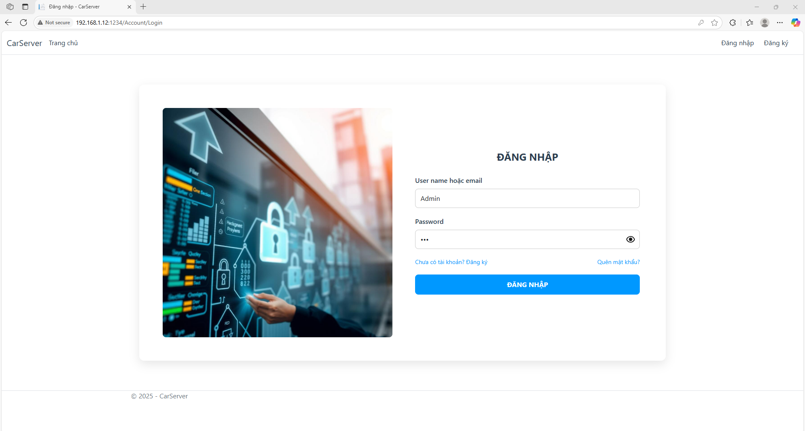

### 📝 Đăng ký
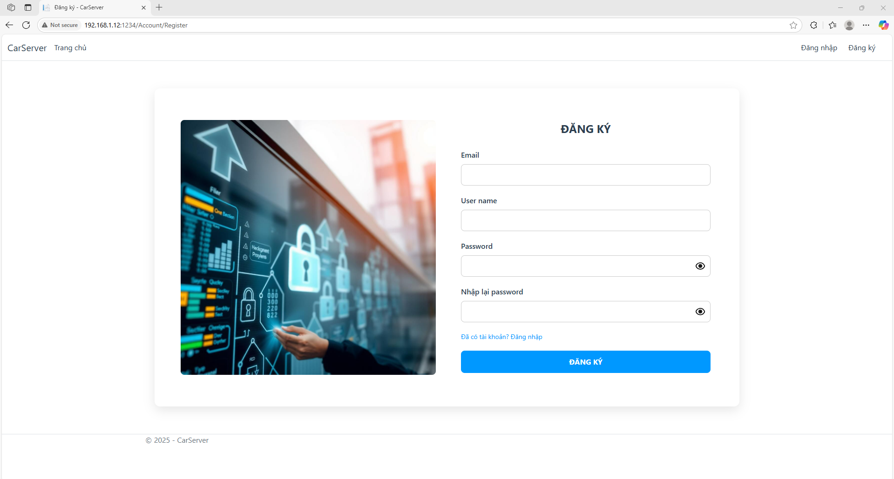

### 💭 Quên mật khẩu
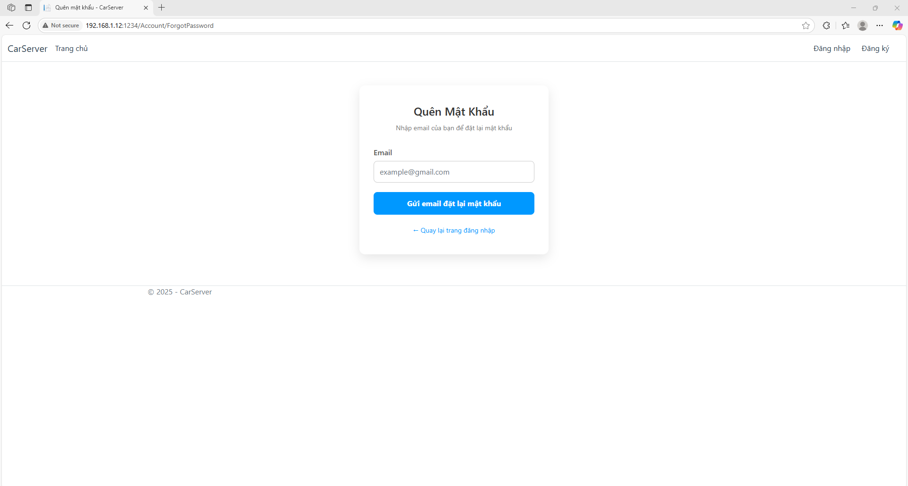

### 🛠️ Reset mật khẩu
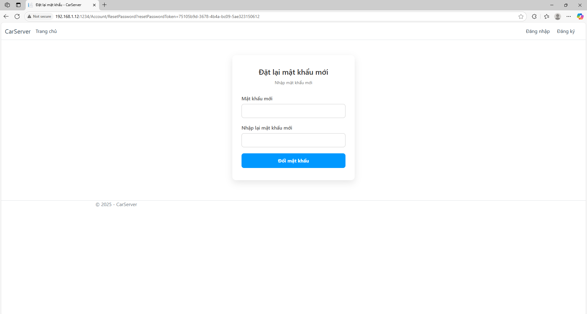

### 👥 Danh sách User
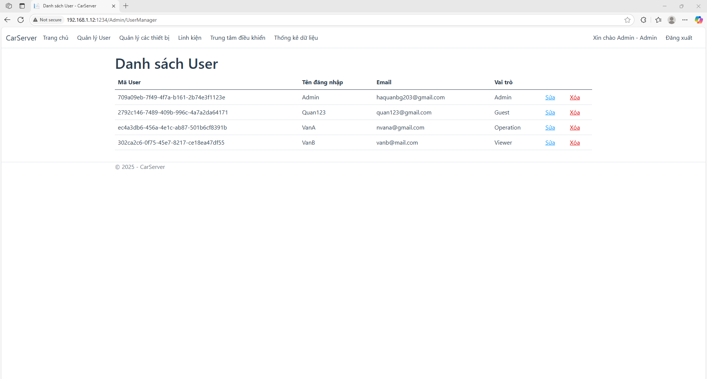

### 👤 Chỉnh sửa User
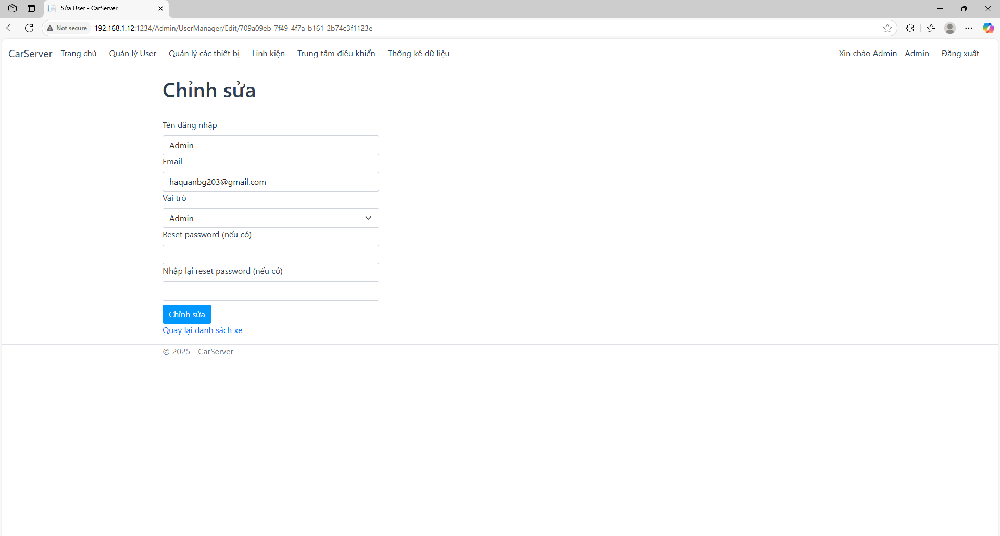

### 💾 Danh sách linh kiện
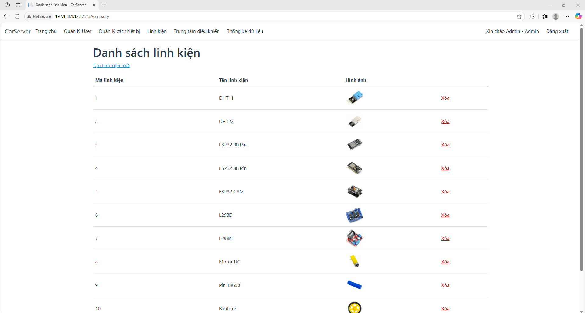

### ⚙️ Tạo linh kiện
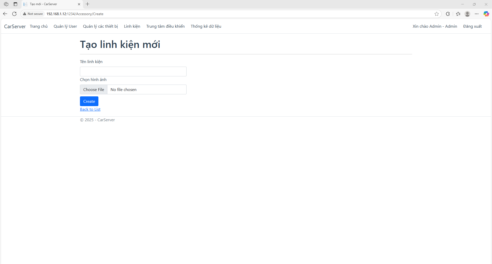

### 🚙 Danh sách xe
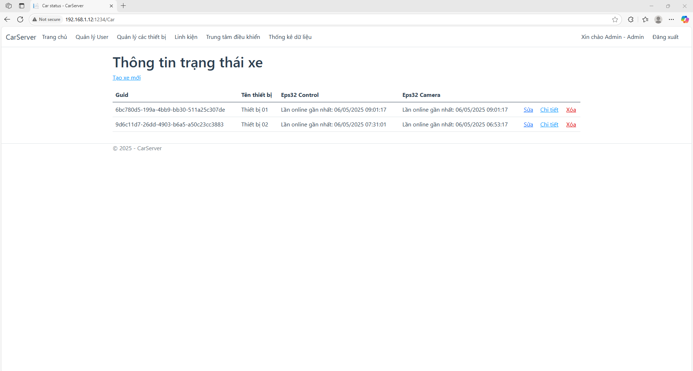

### 🚕 Tạo xe
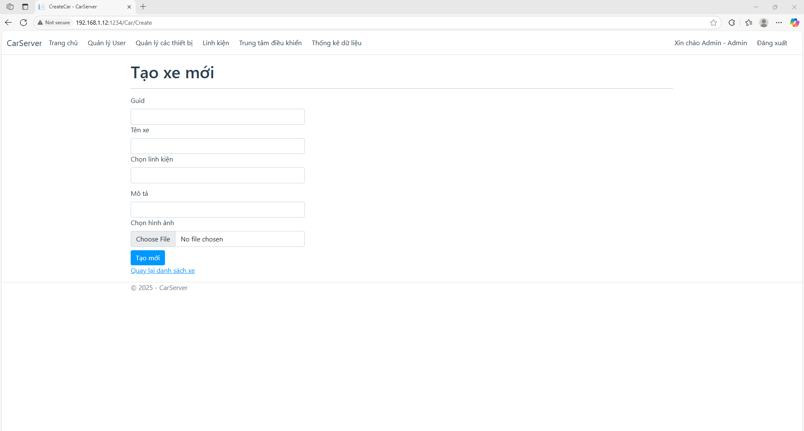

### 🔧 Chỉnh sửa xe
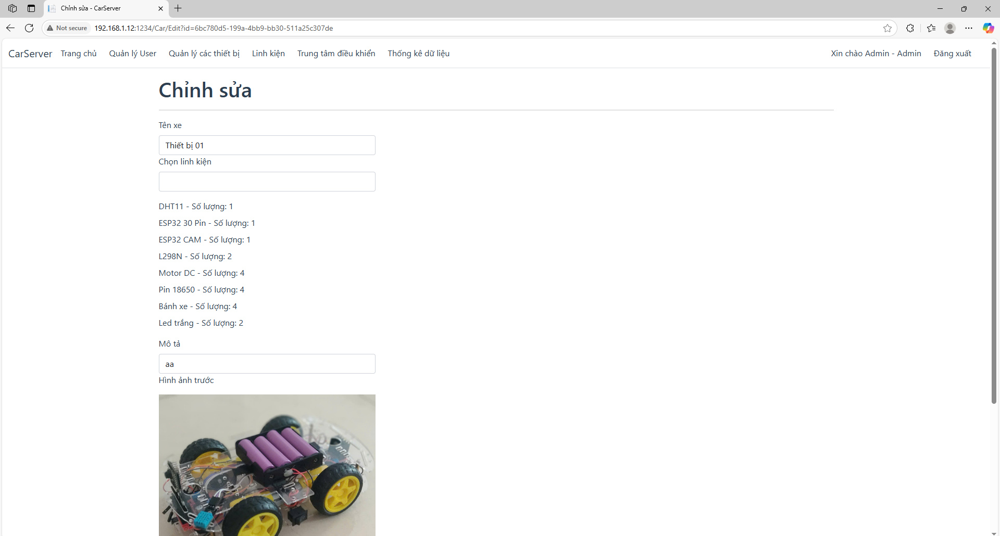

### 🛣️ Chi tiết xe
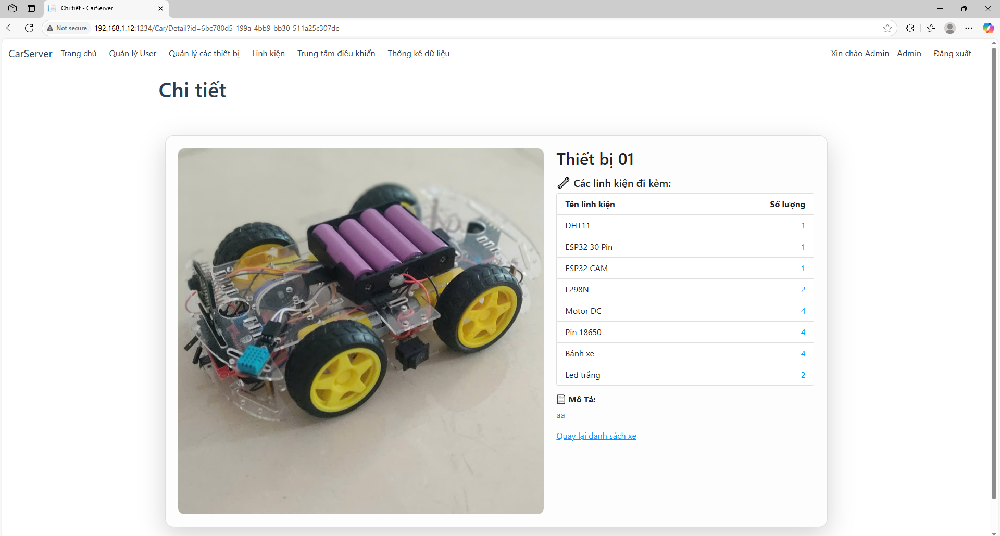

### 🚦 Điều khiển xe
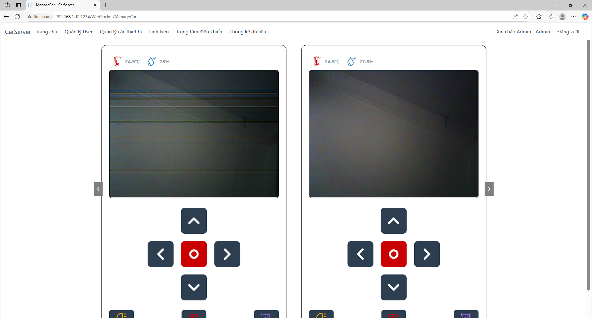

### 📷 Danh sách hình ảnh thu được
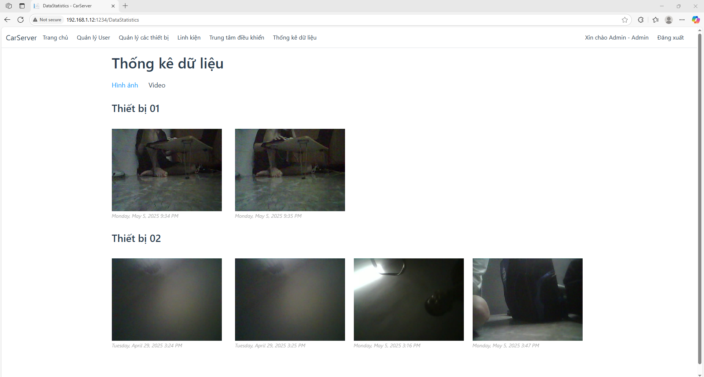
           
### 🎞️ Danh sách video thu được
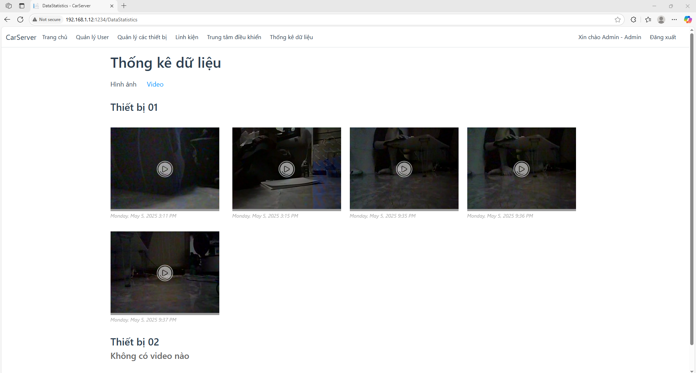

---
## 🎓 **Tác giả**

Hà Đức Quân  
[https://github.com/QuanHa203](https://github.com/QuanHa203)

## 📜 **Bản quyền**

© 2025 QuanHa
Dự án phát triển phục vụ mục đích học tập.
Giấy phép: [MIT License](LICENSE)
